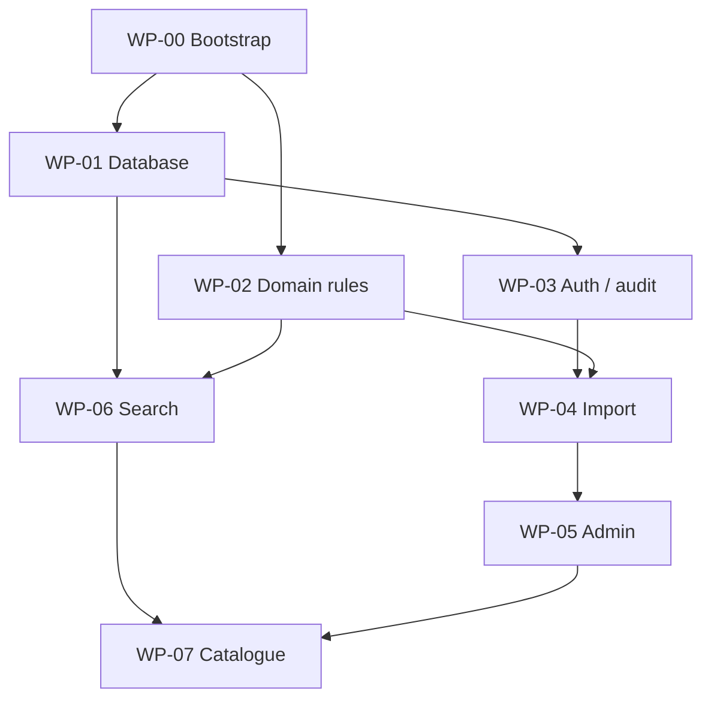

# Builder work packages

Each work package should be a small reviewed pull request or a short sequence of dependent pull requests. Do not combine unrelated packages into one large agent run.

## WP-00 — Bootstrap and decision lock

**Depends on:** none

**Deliver:** production repository, protected `main`, staging preview, CI for current checks, filled environment inventory, updated decision log.

**Accept when:** clean clone installs, tests, and builds; demo deployment is crawler-blocked; no secrets are committed.

## WP-01 — Database and migration integrity

**Depends on:** WP-00

**Deliver:** managed staging PostgreSQL, generated migration applied, migration rollback/recovery notes, fresh-database test, seed fixture, automated backup configuration.

**Accept when:** schema applies from zero, seed is idempotent, and a restore drill is documented.

## WP-02 — Domain rules as a versioned package

**Depends on:** WP-00

**Deliver:** strict/loose identifier functions, collision behavior, confidence evaluator, safety evaluator, publication gate, error codes, table-driven fixtures, ruleset versions.

**Accept when:** every example in `TRUST_SAFETY_AND_MODERATION.md` has a passing test and recomputation is deterministic/idempotent.

## WP-03 — Staff auth and audit foundation

**Depends on:** WP-01

**Deliver:** invite-only authentication, disabled public signup, editor/reviewer/admin roles, MFA for reviewer/admin, server-side authorization helpers, immutable audit writer.

**Accept when:** anonymous users read published views only; editors cannot publish; all privileged changes are attributed.

## WP-04 — CSV import and entity resolution

**Depends on:** WP-01, WP-02, WP-03

**Deliver:** import schemas, dry-run report, commit transaction, duplicate URL/model/OEM detection, ambiguous collision queue, idempotency keys, import audit.

**Accept when:** the 20 Phase 0 records import twice without duplication and malformed/ambiguous rows fail with actionable codes.

## WP-05 — Admin editorial workflow

**Depends on:** WP-03, WP-04

**Deliver:** source, model, component, OEM, design, revision, fitment, evidence, rights, safety, and publication editors; queue dashboard; preview; archive/redirect.

**Accept when:** a non-developer can take a creator-submitted URL from pending through published or rejected, with every transition audited.

## WP-06 — Production search

**Depends on:** WP-01, WP-02

**Deliver:** denormalized public search view, exact strict/loose identifier ranking, brand-scoped collision handling, component synonyms, trigram fallback, cursor API, query test corpus.

**Accept when:** ≥95% of known exact identifiers rank correctly and ambiguous loose matches never auto-resolve.

## WP-07 — Production public catalogue

**Depends on:** WP-05, WP-06

**Deliver:** replace demo repository, model/part page queries, per-model fitment evidence, source/rights/print/safety surfaces, cache tags, unavailable-source behavior, redirects.

**Accept when:** only publication-eligible records appear; one model can show different labels for different design revisions; demo data is absent outside tests.

## WP-08 — Anonymous contribution loop

**Depends on:** WP-03, WP-05

**Deliver:** missing-part, design-link, and fit-report endpoints; rate limits; Turnstile or equivalent; deduplication; consent; private queue; email follow-up hooks.

**Accept when:** spam/invalid input is contained, no submission auto-publishes, and `print_failed` remains separate from `does_not_fit`.

## WP-09 — Private media (optional launch scope)

**Depends on:** WP-03, WP-08

**Deliver:** signed uploads, allowlisted image MIME/size, content sniffing, private bucket, checksum, EXIF removal, thumbnails, rights/consent, retention job, redaction workflow.

**Accept when:** originals are never public by default and rejected/expired media follows the retention policy.

If this package risks the launch schedule, launch without photo uploads and accept external evidence links for moderation.

## WP-10 — Source adapters and link health

**Depends on:** WP-04, WP-05

**Deliver:** source-policy enforcement, official API adapter where allowed, manual/creator-submission path for other platforms, idempotent ingestion state machine, scheduled link/rights checks.

**Accept when:** a blocked/expired source policy prevents adapter execution and a removed source moves affected records to review.

## WP-11 — SEO, analytics, accessibility, and trust pages

**Depends on:** WP-07, WP-08

**Deliver:** canonical/index rules, sitemaps, breadcrumbs/structured data, analytics events, zero-result reporting, public policies, keyboard/a11y tests, performance budget.

**Accept when:** sitemap audit passes and every structured fact is visible on its page.

## WP-12 — Security, monitoring, release, and restore

**Depends on:** all launch packages

**Deliver:** CSP/security headers, origin checks, error monitoring, alert ownership, secret review, dependency policy, backups, restore drill, release checklist, incident/takedown runbook.

**Accept when:** all launch gates pass and the owner can restore data, unpublish a disputed record, and answer a rights/safety notice without developer improvisation.

## Parallel tracks

The data-validation track runs alongside WP-00 through WP-07. Do not let builders invent real compatibility records to unblock UI work; use explicitly fictional fixtures.
