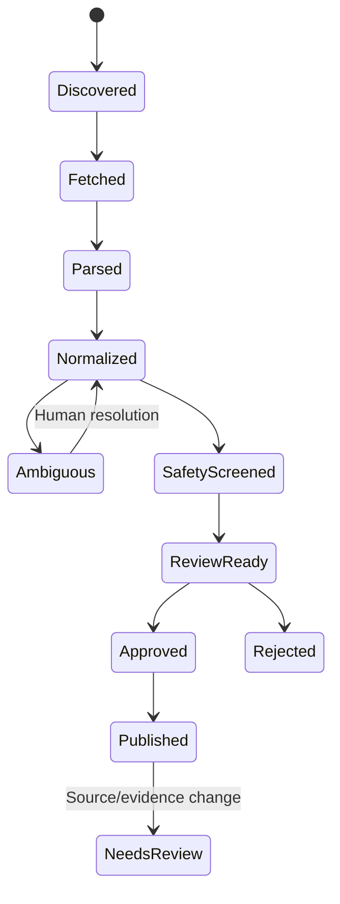

# Data gathering, normalization, and ingestion

## Start with a validation corpus, not mass scraping

Create 100 real queries before selecting launch brands. Include:

- Exact model + broken component
- OEM part number + printable replacement
- Model aliases and regional suffixes
- Component synonyms used by non-experts
- Existing designs that are difficult to discover by exact model
- Searches with no solution but repeated repair demand

Use `data/templates/validation_queries.csv` and `brand_audit.csv`.

Score brands on:

- Number of useful low-risk designs found
- Exact-model specificity
- Availability of OEM/manual mappings
- Model ambiguity burden
- Source-policy feasibility
- Evidence/verification practicality
- Demand signal in repair datasets/communities

Choose depth over equal brand coverage. If one brand has 60 strong designs and another has 5, deepen the strong brand.

## Minimum records to gather

### Product model

- Brand and category
- Exact label model string
- Aliases, family, market/region, suffix, and serial break where relevant
- Production dates if sourced
- Label location guidance
- Source citation for every equivalence claim

### Physical component / OEM part

- Canonical component name and user synonyms
- OEM number display, strict key, loose key
- Superseded/alias numbers with relationship type
- Exact compatible models, region, and serial range
- Manufacturer/manual/catalogue source

### Printable design revision

- Original landing-page URL and platform external ID
- Creator and profile
- Title and revision/version
- Licence code/version/URL/evidence
- Separate image rights if any image is reused
- Source published/updated/retrieved/last-checked dates
- File formats as metadata only
- Claimed models/components/OEM parts copied as an internal cited claim

### Fitment evidence

- Exact model and design revision
- Outcome
- Evidence kind
- Independent actor key
- Model-label proof, installed photo, measurements, and modification notes
- Observation date, source/submitter, moderation status, reviewer, and reason

### Print recipe

- Material, nozzle, layer height, walls, infill, supports, orientation
- Extra hardware and estimated time when sourced
- Provenance: creator, community, or editorial
- Source citation

### Safety

- Failure consequence
- Load, motion, heat, water, chemical, UV, electrical, pressure, food, child, and life-safety exposures
- Safety signals, class, rationale, ruleset, reviewer, date

## Import files

The templates under `data/templates/` are intentionally normalized and join through stable external keys:

1. `product_models.csv`
2. `product_identifiers.csv`
3. `components.csv`
4. `oem_parts.csv`
5. `product_components.csv`
6. `designs.csv`
7. `fitments.csv`
8. `fitment_evidence.csv`

Sources and policies live in `source_registry.example.json`. Controlled values live in `controlled-vocabularies.json`.

Import sequence follows dependencies. The importer must support `--dry-run` and produce:

```json
{
  "runId": "imp_01...",
  "inputChecksum": "sha256:...",
  "counts": { "insert": 18, "update": 2, "unchanged": 40, "reject": 3 },
  "errors": [
    { "file": "product_identifiers.csv", "row": 19, "code": "MODEL_AMBIGUOUS", "detail": "Loose key collides within brand." }
  ]
}
```

Commit only an unchanged dry-run input checksum. Re-running the same import must not duplicate data.

## Source policy registry

Every platform has an enforced record:

```text
platform
policy: api | creator_submission | written_permission | link_only | blocked
terms_url
terms_checked_at
permission_scope
allowed_fields[]
image_reuse_allowed
file_rehosting_allowed
automation_allowed
commercial_use_allowed
adapter_enabled
```

An adapter refuses to run if the policy is blocked, disabled, missing, or stale. This prevents a future agent from quietly adding an unofficial scraper.

Initial operating position:

- Thingiverse: investigate/use the official registered API within its agreement.
- Printables: creator/manual link submission unless written permission allows more.
- MakerWorld: blocked from automation until written permission.
- iFixit: taxonomy/outbound links only unless commercial rights are obtained.
- Open Repair Alliance: demand/category analysis under its dataset terms; not fitment evidence.
- Manufacturer documents: cite factual mappings; do not republish pages/diagrams/descriptions.

Re-check the current terms before implementing any adapter.

## Ingestion state machine



Each content version is idempotent by platform + external ID + content checksum.
Every acquisition also writes an immutable edge containing origin, exact policy
review, adapter run/version, actor, request and retrieval time. Exact retries
reuse that edge; a new origin, policy or run never borrows the older provenance.

## AI extraction boundary

AI may:

- Propose normalized component names and aliases
- Extract claimed model strings, materials, settings, and OEM numbers into a schema
- Flag likely duplicates/collisions
- Suggest source passages for reviewer attention

AI may not:

- Create an equivalence, supersession, fit, safety, or rights fact by itself
- Turn repository copy into original RepairPrint prose without review
- Promote a fitment status
- Resolve ambiguous suffixes silently

Store extraction model, prompt/schema version, output, validation errors, and the source read. The source—not the AI output—is the evidence.

## Moderation order

1. Rights/safety notices
2. Fit disputes
3. Broken links or changed revisions
4. New fit reports
5. Creator design submissions
6. Discovered candidates
7. Missing-part requests

No imported or submitted item auto-publishes.

## Suggested failure codes

```text
SOURCE_POLICY_BLOCKED
SOURCE_POLICY_STALE
API_OR_PERMISSION_MISSING
DUPLICATE_EXTERNAL_ITEM
MODEL_AMBIGUOUS
PART_NUMBER_AMBIGUOUS
REVISION_UNKNOWN
MISSING_PROVENANCE
LICENSE_NOT_RECORDED
IMAGE_RIGHTS_UNKNOWN
SAFETY_REVIEW_REQUIRED
SAFETY_EXCLUDED
FITMENT_EVIDENCE_INSUFFICIENT
CONFIDENCE_STALE
EXTERNAL_LINK_UNAVAILABLE
IMPORT_INPUT_CHANGED
```

## Link and staleness checks

- Check original landing pages on a staggered schedule; respect source limits.
- Record status, redirect target, latency, bounded content checksum, and sanitized error.
- A removed/restricted source queues affected records for review.
- A material design revision creates a new revision; old evidence does not transfer automatically.
- Expired policy/rights checks disable new ingestion until reviewed.
