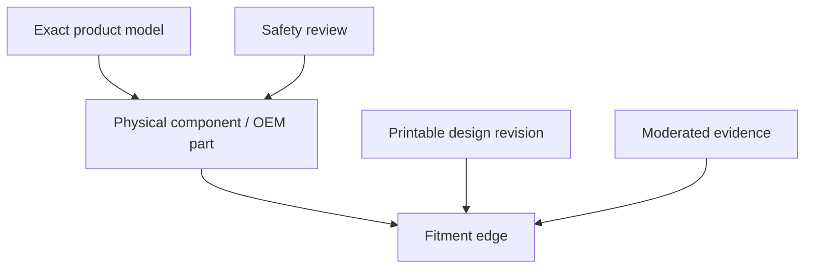

# Product blueprint

## Product promise

> Tell RepairPrint the exact product you own. It will show printable replacements, what each design fits, the evidence behind that fit, the print recipe, the safety boundary, and the original creator’s source.

## Primary jobs to be done

1. “I know my model number; show me printable repairs for it.”
2. “I found an OEM part number; tell me what it is and whether a printable replacement exists.”
3. “I know what broke but not what it is called.”
4. “I printed this design; help me report whether it fit.”
5. “I made a useful design; index it without taking my file away from its original page.”
6. “Nothing exists; record demand and tell me if a solution appears.”

## Core graph

Compatibility is never a property of a design in the abstract. The same revision may be verified for one model, creator-listed for another, and disputed for a third.

## MVP scope

### Public

- Search model identifiers, aliases, OEM numbers, and component names
- Resolve ambiguous regional/suffix variants instead of guessing
- Homepage, model pages, canonical part pages, and non-indexed search results
- Fitment badges with inspectable evidence
- Print settings marked as creator-, community-, or editorial-sourced
- Creator, source platform, licence state, revision, retrieval date, and last-check date
- Original-source outbound link
- OEM/aftermarket alternative links where editorially useful
- Missing-part request
- Fit confirmation/failure report
- Creator/source-link submission
- Human model-label identification request once private photo handling exists
- Methodology, safety, licensing, privacy, corrections, and takedown policies

### Internal

- CRUD for brands, categories, exact models, identifiers, components, OEM parts, designs, revisions, fitments, evidence, safety reviews, sources, and citations
- CSV dry-run/commit import with row-level error output
- Duplicate/collision queues
- Source-policy registry
- Evidence, rights, safety, and publication queues
- Immutable audit trail and archive/redirect behavior
- Broken-link and stale-rights checks
- Search and zero-result analytics

## Explicitly deferred

- Public accounts, profiles, comments, ratings, and forums
- STL/3MF/G-code hosting, mirroring, conversion, or slicing
- Marketplace, bounties, checkout, commissions, or print fulfilment
- Automated scraping of unsupported sites
- AI-generated CAD or instant AI fit verification
- Automatic model-label OCR until a measured labelled dataset exists
- Visual part matching and vector search
- Mobile applications and public API products
- Saved household inventory
- Live price scraping
- Safety-critical, food-contact, electrical, battery, gas, structural, guard, child-safety, or life-safety parts

## Page taxonomy

| Route | Indexing | Purpose |
| --- | --- | --- |
| `/` | Yes after launch | Search and trust promise |
| `/search?q=` | No | Query resolution and zero-result path |
| `/categories/[category]` | Conditional | Category guidance once sufficiently populated |
| `/brands/[brand]` | Conditional | Supported exact models and repairs |
| `/brands/[brand]/[model]` | Yes when useful | All published solutions for one exact model |
| `/parts/[brand-model-component]` | Yes when eligible | Canonical physical repair-part cluster and fitments |
| `/designs/[slug-publicId]` | No by default | Source/design metadata without thin SEO duplication |
| `/request-part` | No | Private missing-demand intake |
| `/submit-design` | No | Original source-link intake |
| `/confirm-fit` | No | Private fit evidence intake |
| `/methodology`, `/safety`, `/licensing` | Yes | Trust policies |

One canonical part page may list several designs and compatible exact models, but the evidence/status must remain separate per model and design revision.

## Main flows

### Exact model known

1. Normalize the query without discarding the display value.
2. Rank strict exact identifier matches first.
3. If a loose key collides, require model/region/suffix selection.
4. Show the exact-model page.
5. Let the user select the broken component.
6. Rank verified, community-confirmed, creator-listed, candidate, then disputed/unavailable.
7. Send downloads to the original creator page.
8. Ask for an optional fit report after outbound use.

### OEM part known

1. Preserve meaningful leading zeros.
2. Match exact/alias/superseded numbers within brand context.
3. Show the physical component and cited model mappings.
4. Display print designs with independent per-model fit labels.

### Model unknown

1. Show brand-specific label-location guidance.
2. Accept a private label photo only after secure media workflow exists.
3. Redact serial numbers and personal data.
4. Route to human identification; never promise instant AI recognition in v0.

### Nothing found

1. Capture brand, exact model, broken component, OEM number, notes, and optional alert email.
2. Normalize and merge likely duplicates for review.
3. Count distinct demand privately.
4. Convert repeated requests into research tasks.

### Fit report

The reporter must choose one outcome:

- Fits without modification
- Fits after modification
- Does not fit
- Print failed before fit could be tested
- Unsure

Only accepted exact-model/exact-revision evidence affects the public label. Modified fits preserve the modification instructions. Print failures do not count as incompatibility.

## Ranking

Confidence tier controls primary order:

1. Verified fit
2. Community confirmed
3. Creator listed
4. Candidate
5. Disputed/rejected/unavailable

Within one tier, prefer exact-model evidence, newer accepted evidence, no-modification results, complete print documentation, live source links, and lower safety uncertainty. Never boost compatibility by affiliate payout, sponsorship, or ad value.

## Launch dataset

- Audit 100 genuine repair queries before choosing the five launch brands
- Normalize 25–30 model families and all materially different suffix/region variants encountered
- Index 100–200 useful design revisions
- Independently verify at least 30 exact-model fitments
- Publish only low-risk parts

The target is intentionally evidence-heavy. Five hundred weak pages would damage the product more than one hundred excellent records.

## Success metrics

### North star

**Successful match session:** an exact model/component resolves and the user follows a Creator Listed-or-better design to its original source.

### Quality

- ≥95% top-result accuracy on the fixed identifier test corpus
- Zero silent ambiguous-model merges
- 100% public records complete for provenance, rights state, evidence, and safety
- ≥98% live source landing pages
- <5% accepted negative-fit rate among confirmed/verified records
- Median dispute/safety notice response under two working days

### Product funnel

- Search submitted
- Exact model resolved
- Variant disambiguation shown/completed
- Zero result
- Part page viewed
- Original source clicked
- Fit report started/submitted/accepted
- Missing part requested
- Design link submitted

Traffic is a lagging metric during the first 90 days. Match accuracy, source clicks, requests, and fit confirmations matter first.
