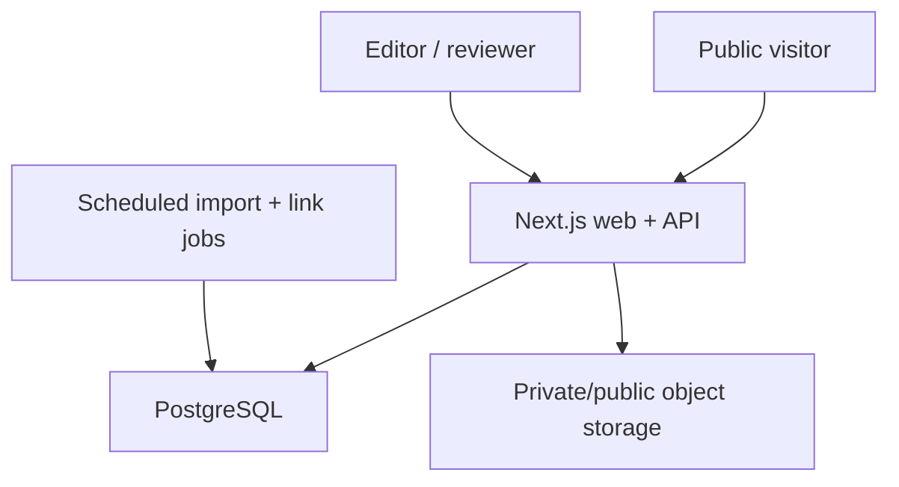

# Technical architecture

## Smallest production-worthy stack

| Layer | Choice | Why |
| --- | --- | --- |
| Application | Next.js App Router, TypeScript | Server-rendered catalogue, APIs, forms, metadata, caching, and broad agent familiarity in one app |
| Database | Managed PostgreSQL; Supabase recommended | Relational graph, backups, optional Auth/Storage/RLS, local-to-managed path |
| Query layer | Drizzle CRUD plus hand-written SQL for search | Type safety without hiding PostgreSQL ranking features |
| Search v0 | Exact keys, B-tree/GIN, full text, `pg_trgm` | Correct for model/OEM identifiers and enough for early scale |
| Auth | Invite-only staff auth | Public users do not need accounts |
| Media | Separate private/public object-storage buckets | Submission photos require different rights/privacy treatment |
| Hosting | Vercel or equivalent Node host | Simple preview/staging/production workflow |
| Tests | Vitest, then PostgreSQL integration and Playwright/axe | Domain, data, journey, and accessibility coverage |

The scaffold pins current stable package versions in `package.json`. Re-check them through normal dependency PRs; do not blindly float production dependencies. Next.js documents the App Router and its route, metadata, sitemap, testing, and deployment primitives in its [official App Router documentation](https://nextjs.org/docs/app).

Supabase is a convenient production default, not a hard dependency. The repository uses plain PostgreSQL and can run against another managed provider. Relevant official references: [Supabase local development](https://supabase.com/docs/guides/local-development) and [Supabase full-text search](https://supabase.com/docs/guides/database/full-text-search).

## Runtime topology



No microservice, queue vendor, vector store, or dedicated search engine is needed for v0. Scheduled/manual jobs can run through CI or host cron until job duration or reliability measurements justify a durable worker.

## Code boundaries

```text
src/app/          routes, server-rendered pages, request handlers
src/components/   presentation components
src/domain/       pure, deterministic, versioned product judgment
src/db/           schema and database client
src/lib/          repository, validation, request and orchestration code
scripts/          imports, audits, seed, link checking, recomputation
drizzle/          reviewed schema migrations
data/             fictional fixtures and reviewed import packs
docs/             operating specification and policies
```

Keep the application as one repository and one deployable service. Split packages only if reuse or build boundaries become real; a premature monorepo does not improve the fitment graph.

## Data model

The generated migrations currently create 44 tables. The most important separation is:

- `product_models`: exact products, not broad marketing families
- `product_identifiers`: display, strict, and loose model keys
- `components`: the human physical-part concept
- `oem_parts` and `oem_part_supersessions`: manufacturer identifiers and cited relationships
- `product_components`: the component/OEM mapping for one exact model and optional serial range
- `designs` and `design_revisions`: creator work and immutable source revisions
- `fitments`: one design revision × one exact product component
- `fitment_evidence`: moderated claims/reports for that edge
- `safety_reviews`: independent failure-consequence review
- `sources` and `source_citations`: provenance down to individual claims
- `source_platform_policies`: enforced permission/ingestion registry
- `source_policy_reviews`, adapter runs, checksum-versioned source candidates and immutable acquisition edges: approval provenance and private ingestion state without losing same-content run/origin/policy attribution
- `source_link_check_jobs` and append-only `source_link_checks`: bounded database-clock monitoring and retained observations
- `submissions`, immutable `submission_idempotency_bindings`, `submission_intake_contacts`, `submission_hmac_key_pin`, rate buckets and intake-scoped follow-ups: private contribution identity, retention and operations
- `private_analytics_daily_aggregates`: bounded UTC-day usage counts with no raw event, request, network, browser, contact, or free-text rows
- `audit_log`, `slug_history`, and `source_link_checks`: accountability and retained history

WP-10 source workers connect directly only as the LOGIN role `repairprint_source_service`. That role has
no table privileges and can execute four narrow security-definer functions.
The no-login maintenance owner holds only the table privileges needed by those
functions. The maintenance owner remains NOLOGIN. Adapter platform and review ID are bound before `fetchCandidate`, then the transaction locks and revalidates the complete current policy snapshot; link
requests validate HTTPS host and every resolved/redirect address, pin the
validated address, and bound redirects, bytes, timeout and concurrency.

WP-11 analytics is a separate first-party database boundary. The LOGIN role
`repairprint_analytics_service` owns no relation and has no direct table access;
it can execute only the bounded aggregate recorder owned by the no-login
`repairprint_analytics_maintenance` role. Runtime collection is disabled unless
the exact aggregate mode and dedicated service credential are configured. A
reporting credential is deliberately separate from that write-only service and
remains unprovisioned until product/privacy owners approve retention and
operations approves its least-privilege read scope.

Use UUIDs internally and stable non-sequential `public_id` values where an identifier must appear in an API or stable URL.

### Required schema follow-ons before launch

- Staff profile/role table tied to the selected auth provider
- Private media asset and consent/retention records if photo uploads launch
- Search document materialized view (implemented by WP-06 migration `0003`)
- Database-level publication transaction/function
- Row-level policies or published-only views for anonymous reads
- A notice/takedown record if it is not represented as a typed submission

## Identifier normalization

Retain the display string exactly as sourced and compute two separate keys:

```text
Display: SMS46MI05E/01
Strict:  SMS46MI05E/01
Loose:   SMS46MI05E01
```

- Strict key: Unicode NFKC, uppercase, normalized whitespace, meaningful punctuation retained.
- Loose key: uppercase alphanumeric characters only; leading zeros retained.

Search a strict exact key first. A loose collision must be scoped by brand and remain ambiguous when more than one exact model survives. Never use an LLM to assert regional equivalence, supersession, or family identity.

## Search v0

PostgreSQL’s `pg_trgm` extension provides similarity operators and GIN/GiST index support for fuzzy text matching; see the [official PostgreSQL documentation](https://www.postgresql.org/docs/current/pgtrgm.html).

WP-06 implements the denormalized `public_search_documents` materialized view:

```text
entity_type
entity_id
public_path
brand_name
model_names_and_aliases
part_numbers_and_aliases
component_names
strict_identifiers[]
loose_identifiers[]
search_vector
confidence_rank
safety_class
publication_status
updated_at
```

### Interpretation order

1. Detect a known brand token.
2. Exact strict OEM/model key.
3. Exact unambiguous loose key within brand.
4. Strict identifier prefix.
5. Model plus component tokens.
6. Trigram typo match on names.
7. Full-text natural-language fallback.

Illustrative base ranks:

| Match | Rank |
| --- | ---: |
| Exact OEM key | 100 |
| Exact model alias | 95 |
| Strict prefix | 80 |
| Model + component | 75 |
| Trigram name | up to 60 |
| Full text | up to 40 |

Add +20 for Verified, +12 for Community Confirmed, and +5 for Creator Listed only after exact entity resolution. Excluded records are hidden. Revenue never affects rank.

Target p95 under 300 ms on the launch corpus. Consider a dedicated search service only after a measured need, not merely because the site is called an index.

## Repository boundary

WP-07 replaces the synchronous fictional repository in `src/lib/catalog.ts`
with cached server-only PostgreSQL use-case methods. The database implementation
reads `public_catalogue_fitments` and the deliberately minimal unavailable-source
view rather than returning raw base-table records:

```ts
search(query, cursor)
getPublishedModel(brandSlug, modelSlug)
getPublishedPartsForModel(modelId)
getPublishedPart(slug)
createSubmission(kind, input)
listReviewQueue(filters, cursor)
publishFitment(id, expectedVersion)
```

Read public catalogue records through published-only SQL views. Publication should be one transaction that re-checks current safety, evidence, rights, source health, and ruleset versions.

## API

Public/read:

```text
GET /api/v1/search?q=&cursor=
GET /api/v1/suggest?q=
GET /api/v1/models/:publicId
GET /api/v1/models/:publicId/solutions
GET /api/v1/fitments/:publicId
```

Anonymous, validated, rate-limited contribution writes:

```text
POST /api/v1/submissions/requests
POST /api/v1/submissions/fit-confirmations
POST /api/v1/submissions/designs
POST /api/v1/submissions/notices
```

First-party, best-effort aggregate telemetry:

```text
POST /api/v1/analytics/events
```

The analytics endpoint accepts only the eight browser event shapes in the
OpenAPI allowlist, requires the exact configured origin and identity-encoded
JSON no larger than 4 KiB, and returns no stored identifier. Raw search text,
contribution values, network/browser identifiers, cookies and referrers are not
part of its contract. Submission-completion events are derived on the server
only after a genuinely new private queue write. Collection failures are reduced
to stable codes and never change the user journey, catalogue rank, fitment,
safety, moderation, or publication.

Admin endpoints are server-authenticated under `/api/admin`. WP-05 provides the
private creator-submission queue and bounded case endpoints; cursor pagination
remains required before production-scale queue volume.

Standard error envelope:

```json
{
  "error": {
    "code": "MODEL_AMBIGUOUS",
    "message": "More than one exact model matches this identifier.",
    "field": "modelNumber",
    "requestId": "req_01..."
  }
}
```

The first-party contract is in `/openapi.yaml`. Analytics uses a deliberately
minimal code-only error envelope so a rejected event cannot echo supplied
properties; contribution and search APIs retain the standard envelope above.

WP-08 routes the three implemented anonymous endpoints through one fail-closed
server boundary: exact configured origin, 16 KiB identity-encoded JSON/form
body, canonical deployment-owned IP identity, database-pinned HMAC-key check, a
global network budget followed by endpoint/contributor atomic limits, strict
raw-first schema and canonical URL handling, configured versioned retention,
server-side Turnstile action/hostname verification, then one transactional
private-queue insert. The key check occurs before any HMAC-derived rate or
contribution identity. The private pin contains only a purpose-separated
commitment plus algorithm/framing version; the key remains an environment
secret generated as 64 hex characters with `openssl rand -hex 32`.

The application stores HMAC digests rather than raw client addresses or
anti-spam tokens. A proven UUID parser canonicalizes the client UUID before
HMAC. Idempotency is uniquely scoped by kind, a contact-independent canonical
network-actor HMAC, and that canonical UUID. Contact/consent and server-selected
policy versions remain in the full request fingerprint, so changing an email,
payload or consent choice conflicts instead of opening a new idempotency
namespace. Endpoint kinds and different network actors remain independent,
while a contributor-scoped semantic digest groups active normalized
contributor/content associations and keeps strict brand/model/OEM punctuation.

`submissions` stores the S1 semantic moderation parent, canonical semantic
payload and shared opaque acknowledgment receipt. Every accepted UUID is its
own immutable B row in `submission_idempotency_bindings`, including semantic
aliases B1/B2 that share S1/R1. Each B row contains its complete private
payload, fingerprint, consent/policy snapshot, acceptance/challenge state,
contact-present digest and independent deadlines. The optional normalized email
is a separate `submission_intake_contacts` child so it can expire without
rewriting the accepted snapshot. Demand aggregation reads the semantic
association, not binding count. Submitted URLs remain private, are canonicalized
for moderation, and are never fetched here.

Persistent paths use a separately credentialed
`repairprint_submission_service` database role whose identity is checked at
runtime. It receives SELECT/narrow INSERT rights on intake relations,
rate-bucket counter operations, SELECT-only key-pin access, and execution of one
bounded cleanup function. It cannot update or directly delete immutable
intakes/contacts or change the pin. Cleanup uses database time, row locks, a
fixed safe search path and the separate no-login
`repairprint_submission_maintenance` function owner. It deletes expired contact
and follow-up children, then fully expired intakes, and removes S1/R1 only after
the final B row expires. Database triggers reject live mutation, truncation and
orphan graph states.

Consent alone creates no email-delivery row. A later typed qualifying event
must select one exact intake and revalidate that intake's active parent, current
consent, contact child and both deadlines before inserting idempotent pending
work. WP-08 has no provider, worker, sender, send operation, or mail fallback.
No intake or cleanup path writes catalogue/publication tables.

WP-08 intentionally does not support live HMAC-key rotation. A missing or
mismatched pin returns a sanitized unavailable response without contribution
writes. Restore the original key to resume service; a future reviewed
keyring/rekey package is required while retained records exist. Owner/admin pin
replacement is an explicit empty-state maintenance operation only.

## Auth and authorization

Roles:

- `editor`: normalize and prepare drafts
- `reviewer`: accept evidence and safety, publish/unpublish
- `admin`: access, policies, archive/merge, operational settings

Rules:

- Disable self-service signup.
- Require MFA for reviewer/admin.
- Keep service credentials server-only.
- Anonymous catalogue reads use only published views.
- Anonymous contribution writes pass through origin/body controls, durable rate limits, server-verified anti-spam, versioned consent, deduplication, and a private queue.
- Editors cannot approve their own material safety/publication decision.
- Every privileged transition writes an immutable audit record.

## Private media

WP-09 implements model-label, installed-fit, and broken-part/context photos with this private flow:

1. Validate anti-spam and create a short-lived signed upload.
2. Allow JPEG/PNG/WebP/AVIF only with real MIME sniffing and size limits.
3. Strip EXIF and compute a checksum.
4. Quarantine the original privately, write only sanitized private derivatives, and remove quarantine after success or terminal rejection.
5. Redact serials, addresses, faces, receipts, and unnecessary personal data.
6. Record contributor rights/consent separately from the design-file licence.
7. Keep every photo and derivative private in WP-09; later public use needs separate consent and review.
8. Delete rejected/expired material according to the retention policy.

Never let a server fetch an arbitrary submitted URL. Adapter domains must be allowlisted to prevent SSRF.

The browser receives only a five-minute single-object RepairPrint capability,
never a storage service key or reusable bucket credential. Session creation
re-resolves the exact immutable WP-08 intake from endpoint, network-actor UUID
scope and receipt. Semantic aliases remain isolated even when they share a
receipt.

## Caching and jobs

Cache published entity pages by model, part, catalogue-index, and sitemap tags.
Publication, evidence moderation, and archive handlers invalidate the global
index plus every affected exact-model and grouped part slug after the database
transaction succeeds. The database transaction still refreshes search before
commit; page-cache invalidation never substitutes for publication filtering.

Initial jobs:

- Source link and redirect check
- Source-policy/terms staleness check
- Confidence recomputation for changed evidence
- Publication invariant audit
- Expired private-media cleanup
- Search view refresh
- Sitemap/canonical/indexability audit

Make every job idempotent, observable, and safe to resume.

## Environments

- Local: Docker PostgreSQL and fictional seed
- Preview: isolated database branch/project, demo or sanitized fixtures, crawler blocked
- Staging: production-like auth/storage/database, crawler blocked
- Production: real reviewed data only

Never share production service credentials or user submission media with previews. Use pooled database connections at runtime and a direct connection only for migrations when the provider requires it.

## Deliberate scaffold gaps

The bootstrap does not pretend unfinished infrastructure exists. Builders still
need to implement media, source adapters, monitoring, and the broader
end-to-end coverage assigned to later work packages. The static demo remains
available only through explicit demo mode while production catalogue and
private-intake paths fail closed on missing infrastructure.
