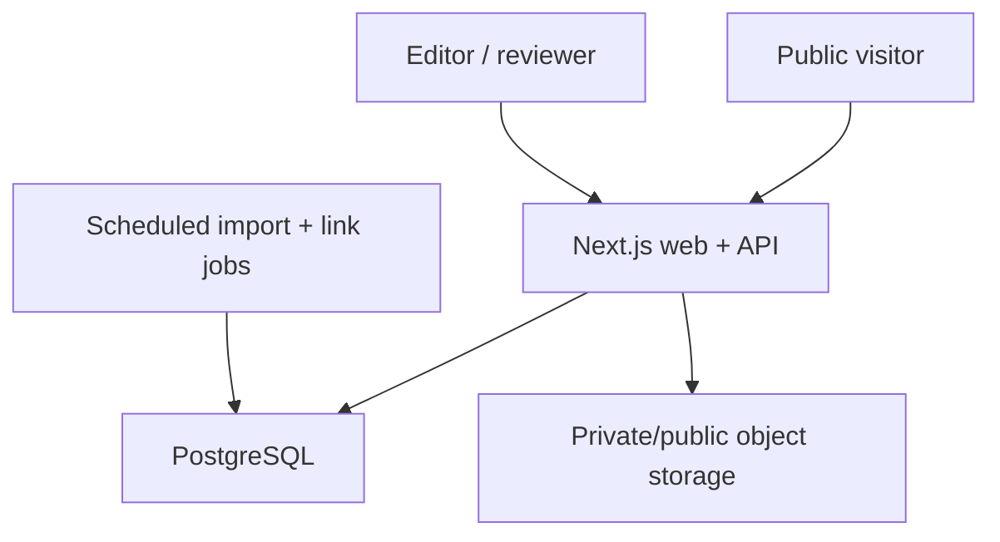

# Technical architecture

## Smallest production-worthy stack

| Layer | Choice | Why |
| --- | --- | --- |
| Application | Next.js App Router, TypeScript | Server-rendered catalogue, APIs, forms, metadata, caching, and broad agent familiarity in one app |
| Database | Managed PostgreSQL; Supabase recommended | Relational graph, backups, optional Auth/Storage/RLS, local-to-managed path |
| Query layer | Drizzle CRUD plus hand-written SQL for search | Type safety without hiding PostgreSQL ranking features |
| Search v0 | Exact keys, B-tree/GIN, full text, `pg_trgm` | Correct for model/OEM identifiers and enough for early scale |
| Auth | Invite-only staff auth | Public users do not need accounts |
| Media | Separate private/public object-storage buckets | Submission photos require different rights/privacy treatment |
| Hosting | Vercel or equivalent Node host | Simple preview/staging/production workflow |
| Tests | Vitest, then PostgreSQL integration and Playwright/axe | Domain, data, journey, and accessibility coverage |

The scaffold pins current stable package versions in `package.json`. Re-check them through normal dependency PRs; do not blindly float production dependencies. Next.js documents the App Router and its route, metadata, sitemap, testing, and deployment primitives in its [official App Router documentation](https://nextjs.org/docs/app).

Supabase is a convenient production default, not a hard dependency. The repository uses plain PostgreSQL and can run against another managed provider. Relevant official references: [Supabase local development](https://supabase.com/docs/guides/local-development) and [Supabase full-text search](https://supabase.com/docs/guides/database/full-text-search).

## Runtime topology



No microservice, queue vendor, vector store, or dedicated search engine is needed for v0. Scheduled/manual jobs can run through CI or host cron until job duration or reliability measurements justify a durable worker.

## Code boundaries

```text
src/app/          routes, server-rendered pages, request handlers
src/components/   presentation components
src/domain/       pure, deterministic, versioned product judgment
src/db/           schema and database client
src/lib/          repository, validation, request and orchestration code
scripts/          imports, audits, seed, link checking, recomputation
drizzle/          reviewed schema migrations
data/             fictional fixtures and reviewed import packs
docs/             operating specification and policies
```

Keep the application as one repository and one deployable service. Split packages only if reuse or build boundaries become real; a premature monorepo does not improve the fitment graph.

## Data model

The generated migrations currently create 28 tables. The most important separation is:

- `product_models`: exact products, not broad marketing families
- `product_identifiers`: display, strict, and loose model keys
- `components`: the human physical-part concept
- `oem_parts` and `oem_part_supersessions`: manufacturer identifiers and cited relationships
- `product_components`: the component/OEM mapping for one exact model and optional serial range
- `designs` and `design_revisions`: creator work and immutable source revisions
- `fitments`: one design revision × one exact product component
- `fitment_evidence`: moderated claims/reports for that edge
- `safety_reviews`: independent failure-consequence review
- `sources` and `source_citations`: provenance down to individual claims
- `source_platform_policies`: enforced permission/ingestion registry
- `submissions`, `submission_rate_limit_buckets`, `submission_email_follow_ups`, `audit_log`, `slug_history`, `source_link_checks`: private intake, operations, and accountability

Use UUIDs internally and stable non-sequential `public_id` values where an identifier must appear in an API or stable URL.

### Required schema follow-ons before launch

- Staff profile/role table tied to the selected auth provider
- Private media asset and consent/retention records if photo uploads launch
- Search document materialized view (implemented by WP-06 migration `0003`)
- Database-level publication transaction/function
- Row-level policies or published-only views for anonymous reads
- A notice/takedown record if it is not represented as a typed submission

## Identifier normalization

Retain the display string exactly as sourced and compute two separate keys:

```text
Display: SMS46MI05E/01
Strict:  SMS46MI05E/01
Loose:   SMS46MI05E01
```

- Strict key: Unicode NFKC, uppercase, normalized whitespace, meaningful punctuation retained.
- Loose key: uppercase alphanumeric characters only; leading zeros retained.

Search a strict exact key first. A loose collision must be scoped by brand and remain ambiguous when more than one exact model survives. Never use an LLM to assert regional equivalence, supersession, or family identity.

## Search v0

PostgreSQL’s `pg_trgm` extension provides similarity operators and GIN/GiST index support for fuzzy text matching; see the [official PostgreSQL documentation](https://www.postgresql.org/docs/current/pgtrgm.html).

WP-06 implements the denormalized `public_search_documents` materialized view:

```text
entity_type
entity_id
public_path
brand_name
model_names_and_aliases
part_numbers_and_aliases
component_names
strict_identifiers[]
loose_identifiers[]
search_vector
confidence_rank
safety_class
publication_status
updated_at
```

### Interpretation order

1. Detect a known brand token.
2. Exact strict OEM/model key.
3. Exact unambiguous loose key within brand.
4. Strict identifier prefix.
5. Model plus component tokens.
6. Trigram typo match on names.
7. Full-text natural-language fallback.

Illustrative base ranks:

| Match | Rank |
| --- | ---: |
| Exact OEM key | 100 |
| Exact model alias | 95 |
| Strict prefix | 80 |
| Model + component | 75 |
| Trigram name | up to 60 |
| Full text | up to 40 |

Add +20 for Verified, +12 for Community Confirmed, and +5 for Creator Listed only after exact entity resolution. Excluded records are hidden. Revenue never affects rank.

Target p95 under 300 ms on the launch corpus. Consider a dedicated search service only after a measured need, not merely because the site is called an index.

## Repository boundary

WP-07 replaces the synchronous fictional repository in `src/lib/catalog.ts`
with cached server-only PostgreSQL use-case methods. The database implementation
reads `public_catalogue_fitments` and the deliberately minimal unavailable-source
view rather than returning raw base-table records:

```ts
search(query, cursor)
getPublishedModel(brandSlug, modelSlug)
getPublishedPartsForModel(modelId)
getPublishedPart(slug)
createSubmission(kind, input)
listReviewQueue(filters, cursor)
publishFitment(id, expectedVersion)
```

Read public catalogue records through published-only SQL views. Publication should be one transaction that re-checks current safety, evidence, rights, source health, and ruleset versions.

## API

Public/read:

```text
GET /api/v1/search?q=&cursor=
GET /api/v1/suggest?q=
GET /api/v1/models/:publicId
GET /api/v1/models/:publicId/solutions
GET /api/v1/fitments/:publicId
```

Anonymous, validated, rate-limited writes:

```text
POST /api/v1/submissions/requests
POST /api/v1/submissions/fit-confirmations
POST /api/v1/submissions/designs
POST /api/v1/submissions/notices
```

Admin endpoints are server-authenticated under `/api/admin`. WP-05 provides the
private creator-submission queue and bounded case endpoints; cursor pagination
remains required before production-scale queue volume.

Standard error envelope:

```json
{
  "error": {
    "code": "MODEL_AMBIGUOUS",
    "message": "More than one exact model matches this identifier.",
    "field": "modelNumber",
    "requestId": "req_01..."
  }
}
```

The initial contract is in `/openapi.yaml`.

WP-08 routes the three implemented anonymous endpoints through one fail-closed
server boundary: exact configured origin, 16 KiB identity-encoded JSON/form
body, canonical deployment-owned IP identity, a global network budget followed
by endpoint/contributor atomic limits, strict raw-first schema and canonical URL
handling, configured versioned retention, server-side Turnstile
action/hostname verification, then a transactional private-queue insert. The
application stores HMAC digests rather than raw client addresses or anti-spam
tokens. Idempotency is uniquely scoped by kind, contributor, and client UUID;
the stored row owns a separate stable receipt. A contributor-scoped semantic
digest groups active duplicates while retaining strict brand/model/OEM
punctuation and independent reports. Submitted URLs are canonicalized for
moderation and are never fetched here.

Persistent paths use a separately credentialed
`repairprint_submission_service` database role whose identity is checked at
runtime. Consent alone creates no email-delivery row. A later typed qualifying
event must revalidate active current consent and retention before inserting
idempotent pending work; WP-08 has no provider or worker. A bounded,
externally-scheduled cleanup redacts expired contact or deletes fully expired
private rows without touching public catalogue records or scheduling mail. No
intake path writes catalogue/publication tables.

## Auth and authorization

Roles:

- `editor`: normalize and prepare drafts
- `reviewer`: accept evidence and safety, publish/unpublish
- `admin`: access, policies, archive/merge, operational settings

Rules:

- Disable self-service signup.
- Require MFA for reviewer/admin.
- Keep service credentials server-only.
- Anonymous users read only published views.
- Anonymous writes pass through origin/body controls, durable rate limits, server-verified anti-spam, versioned consent, deduplication, and a private queue.
- Editors cannot approve their own material safety/publication decision.
- Every privileged transition writes an immutable audit record.

## Private media

Do not add model-label or fit-photo uploads until this flow exists:

1. Validate anti-spam and create a short-lived signed upload.
2. Allow JPEG/PNG/WebP/AVIF only with real MIME sniffing and size limits.
3. Strip EXIF and compute a checksum.
4. Store the original privately.
5. Redact serials, addresses, faces, receipts, and unnecessary personal data.
6. Record contributor rights/consent separately from the design-file licence.
7. Publish only an approved derivative, never the private original by default.
8. Delete rejected/expired material according to the retention policy.

Never let a server fetch an arbitrary submitted URL. Adapter domains must be allowlisted to prevent SSRF.

## Caching and jobs

Cache published entity pages by model, part, catalogue-index, and sitemap tags.
Publication, evidence moderation, and archive handlers invalidate the global
index plus every affected exact-model and grouped part slug after the database
transaction succeeds. The database transaction still refreshes search before
commit; page-cache invalidation never substitutes for publication filtering.

Initial jobs:

- Source link and redirect check
- Source-policy/terms staleness check
- Confidence recomputation for changed evidence
- Publication invariant audit
- Expired private-media cleanup
- Search view refresh
- Sitemap/canonical/indexability audit

Make every job idempotent, observable, and safe to resume.

## Environments

- Local: Docker PostgreSQL and fictional seed
- Preview: isolated database branch/project, demo or sanitized fixtures, crawler blocked
- Staging: production-like auth/storage/database, crawler blocked
- Production: real reviewed data only

Never share production service credentials or user submission media with previews. Use pooled database connections at runtime and a direct connection only for migrations when the provider requires it.

## Deliberate scaffold gaps

The bootstrap does not pretend unfinished infrastructure exists. Builders still need to implement production catalogue queries, rate limiting, media, source adapters, monitoring, and broader end-to-end tests through the remaining work packages. The static demo makes product/UI work runnable while those gates remain honest.
